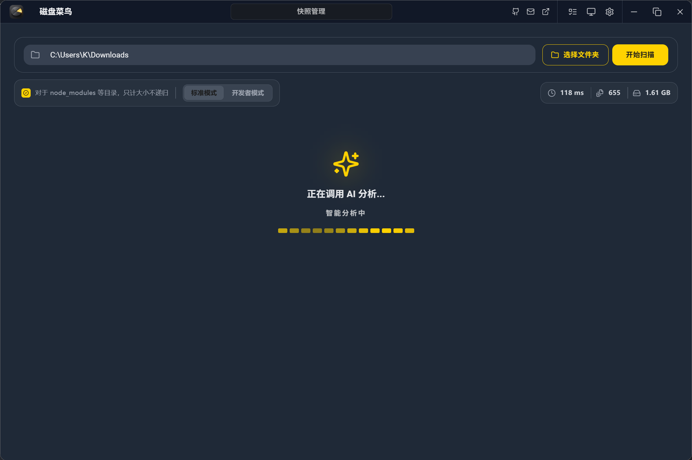
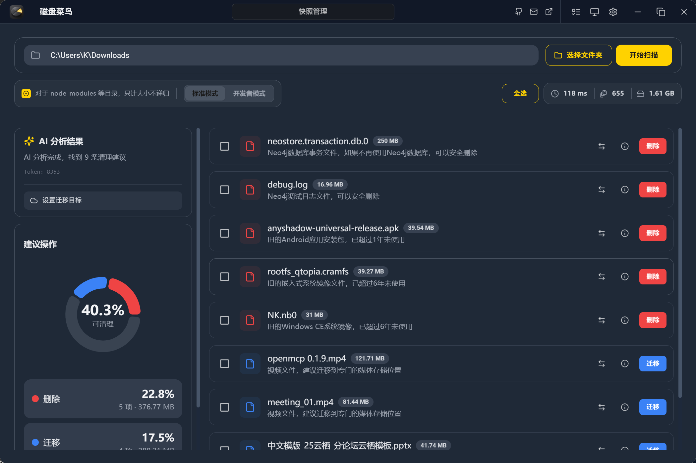
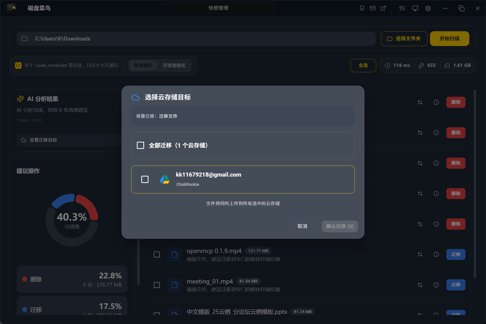
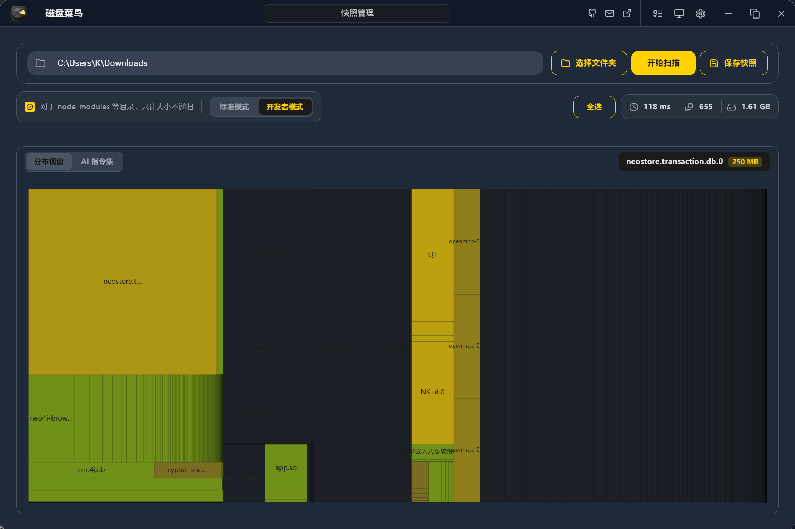
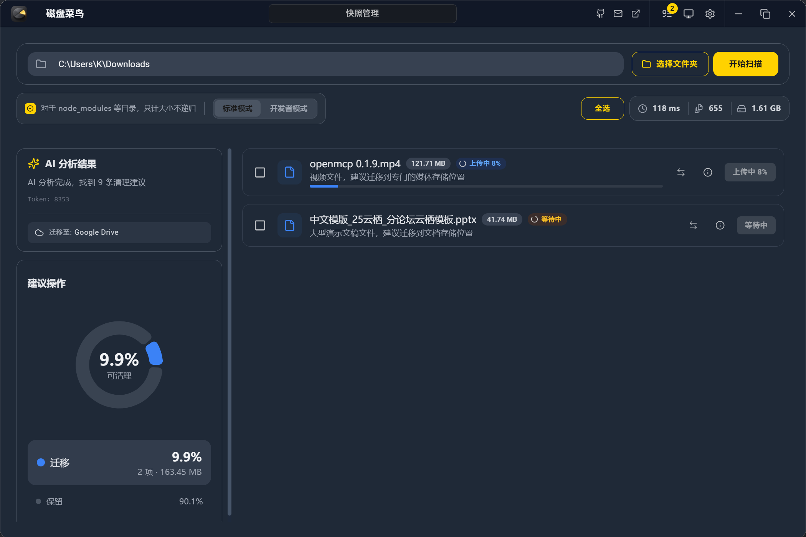

<div align="center">
  

  # DiskRookie 磁盘菜鸟

  <p align="center">
    
    
    
    
  </p>

  让傻子用户也能像电脑糕手一样清理磁盘。

  [快速开始](#快速开始) • [项目架构](#项目架构) • [开发计划](#开发计划) • [贡献指南](#贡献指南)
</div>


---

## 📸 功能预览

通过 AI 智能分析磁盘占用，快速识别可清理或迁移的文件，让磁盘管理变得简单高效。

<div align="center">

| AI 智能分析 | 分析结果展示 |
|:---:|:---:|
|  |  |

| 云存储迁移 | 可视化展示 |
|:---:|:---:|
|  |  |

| 自定义 AI 设置 | 批量操作 |
|:---:|:---:|
|  |  |

</div>

---

## ✨ 核心特性

- 🤖 **AI 驱动分析**：不仅仅是统计大小，更懂文件的用途与价值。
- 🚀 **高性能扫描**：基于 Rust 核心，极速遍历千万级文件。
- 🎨 **工业级 UI**：基于 TailwindCSS 打造的现代化、沉浸式交互体验。
- 🛡️ **安全迁移**：所有 AI 建议均需用户确认，确保数据安全。


---

## 🚀 快速开始

### 🛠️ 环境准备

确保你的开发环境已安装以下工具：

* **Rust**: `rustc 1.86+`
* **Node.js**: `v20+`
* **包管理器**: `npm` 或 `pnpm`

### 🖥️ 开发调试

```bash
# 1. 克隆项目
git clone [https://github.com/your-username/DiskRookie.git](https://github.com/your-username/DiskRookie.git)
cd DiskRookie/apps/desktop

# 2. 安装前端依赖
cd frontend && npm install && cd ..

# 3. 启动开发模式 (自动开启 Rust 后端与 React 前端)
npm run dev

```

### 📦 构建发布

```bash
cd apps/desktop
npx tauri build --target x86_64-pc-windows-msvc
```

---

## 📄 许可证

本项目采用 [Apache License 2.0](https://www.google.com/search?q=LICENSE) 许可证。

Copyright © 2026 **AI Disk Analyzer Contributors**.
